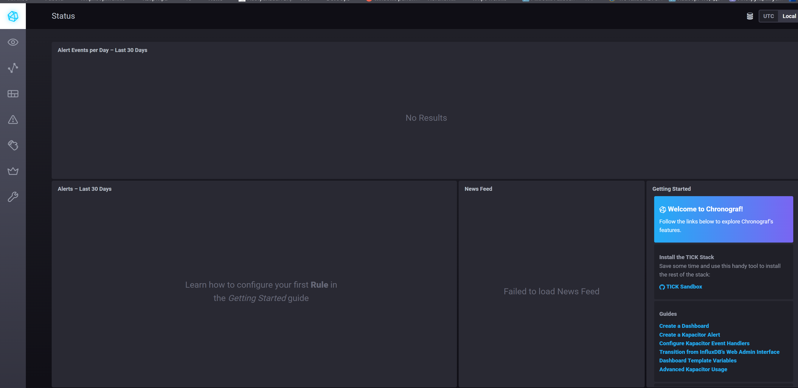
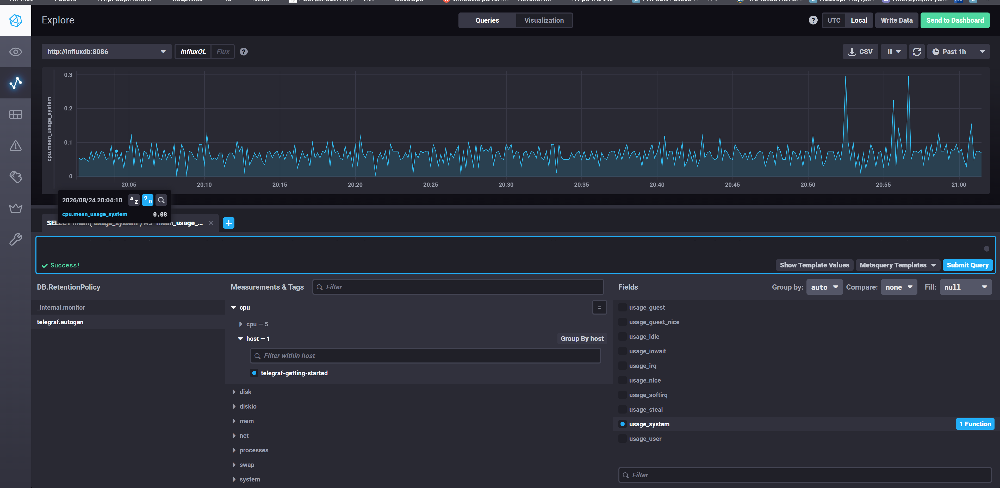
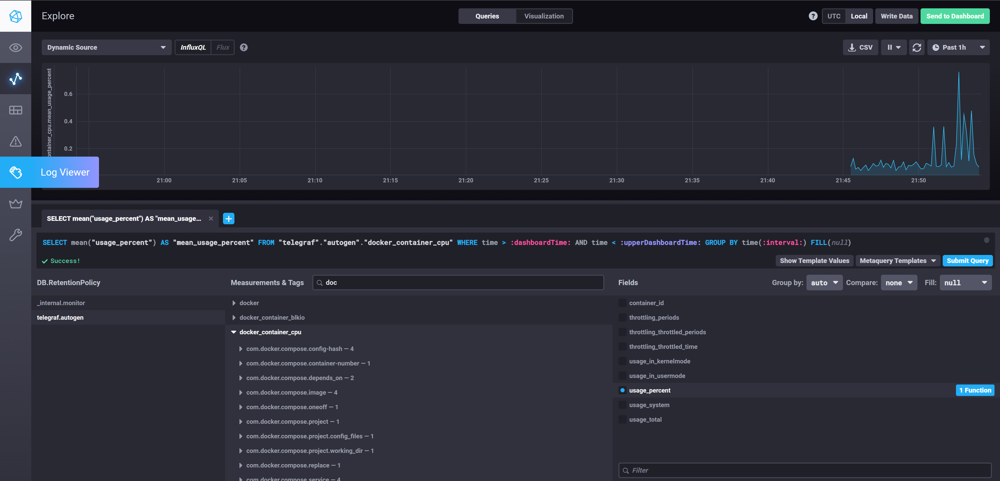

# Домашнее задание к занятию "13. Системы мониторинга"

## Задание 1. Минимальный набор метрик

Метрики подобраны по компонентам системы: вычисления (CPU), хранение
отчётов (диск), взаимодействие (HTTP), базовое здоровье хоста.

**CPU** — вычисления нагружают процессор, это основной ресурс платформы:

- `cpu_usage` (user/system/iowait) — куда именно уходит процессорное время;
  рост iowait укажет не на вычисления, а на проблемы с диском;
- `load average` (1/5/15) — длина очереди задач. Показывает не «процессор
  занят», а «задачи не успевают обрабатываться».

**Диск** — отчёты сохраняются на диск, отказ здесь останавливает основную
функцию продукта:

- `disk free / used %` — заполнение файловой системы;
- `inodes free` — при большом количестве мелких отчётов inode-ы кончаются
  раньше места, и запись падает при формально свободном диске;
- `disk IO utilization`, `write latency` — деградация записи отчётов.

**HTTP** — единственный интерфейс взаимодействия с платформой:

- `requests per second` — профиль нагрузки;
- распределение кодов ответа `2xx / 3xx / 4xx / 5xx` — доля ошибок;
- `response time` в перцентилях `p50 / p95 / p99` — среднее скрывает
  проблемы «хвоста», когда часть пользователей уже страдает;
- количество активных соединений.

**Хост**:

- `RAM used / available`, `swap usage` — уход в swap резко замедлит вычисления;
- доступность процесса и порта (`up`), `uptime` — факт живости сервиса.

Логика набора: каждая метрика закрывает конкретный сценарий отказа —
кончился CPU, кончилось место, кончились inodes, сервис отвечает ошибками,
сервис отвечает медленно, сервис не отвечает вообще.

## Задание 2. Что предложить менеджеру продукта

Менеджеру нужны метрики уровня сервиса, а не уровня железа. RAM и CPU LA —
инструмент диагностики для инженеров, они не отвечают на вопрос «выполняем
ли мы обязательства перед клиентами».

Предлагаю ввести SLI / SLO / SLA:

- **SLI** (Service Level Indicator) — измеримый показатель качества:
  доля успешных HTTP-ответов, время ответа, доступность сервиса;
- **SLO** (Service Level Objective) — внутренняя цель по SLI:
  «99,5% запросов успешны», «p95 времени ответа < 300 мс»;
- **SLA** (Service Level Agreement) — внешнее соглашение с клиентом,
  где нарушение SLO влечёт санкции.

Дополнительно — **error budget**: при SLO 99,5% допустимо 0,5% неуспешных
запросов за период. Это переводит спор «выкатывать быстрее или стабильнее»
в арифметику: бюджет ошибок не исчерпан — релизим, исчерпан — занимаемся
надёжностью.

Практически: отдельный дашборд на бизнес-языке — «доступность сервиса, %»,
«доля успешно выполненных вычислений», «время формирования отчёта»,
«остаток бюджета ошибок до конца месяца». Технические метрики остаются
в инженерном дашборде.

## Задание 3. Логи без бюджета на систему сбора

Задача разработчиков — видеть ошибки приложения, а не собирать все логи.
Это уже, чем полноценный лог-стек, и решается дешевле.

Предлагаемое решение — **Sentry**, развёрнутый self-hosted через
docker-compose (open source, бесплатно):

- собирает именно исключения с трейсбеком, контекстом запроса и версией
  релиза, а не сырой поток логов;
- группирует одинаковые ошибки, показывает частоту и регрессии;
- ресурсов требует несопоставимо меньше, чем ELK.

Альтернативы, если нужен именно поиск по логам:

- **Grafana Loki** — индексирует только метки, а не содержимое, поэтому
  дешевле Elasticsearch по CPU и диску;
- самый бюджетный вариант — централизация через `rsyslog`/`journald`
  на один сервер с ротацией и доступом разработчиков на чтение.

Вывод: отсутствие бюджета на лог-платформу не мешает закрыть исходную
потребность — нужно сузить задачу с «собирать все логи» до «доставлять
ошибки разработчикам».

## Задание 4. Где ошибка в расчёте SLA

Ошибка в формуле, а не в системе.

`summ_2xx_requests / summ_all_requests` считает успехом **только** коды 2xx,
но в знаменателе лежат все ответы. Коды 3xx (редиректы: 301, 302, 304 Not
Modified) ошибками не являются — это штатное поведение, — однако в числитель
не попадают. Отсюда постоянные ~30% «недоступности» при полном отсутствии
4xx и 5xx.

Корректный вариант — считать успешными все ответы, кроме серверных ошибок:

```text
(summ_all_requests - summ_5xx_requests) / summ_all_requests
```

или, если 4xx тоже считаем нарушением качества:

```text
(summ_2xx_requests + summ_3xx_requests) / summ_all_requests
```

Общий вывод: при расчёте SLI нужно явно договориться, какой ответ считается
успешным, иначе метрика измеряет не доступность, а долю одного класса кодов.

## Задание 5. Pull и push модели мониторинга

**Pull** — сервер мониторинга сам опрашивает цели (Prometheus, Nagios).

Плюсы:

- централизованная конфигурация: список целей и интервалы в одном месте;
- сам факт недоступности цели при опросе является метрикой (`up == 0`);
- проще контролировать нагрузку — сервер задаёт частоту опроса;
- цели не нужно настраивать на адрес сервера, они просто отдают `/metrics`.

Минусы:

- нужна сетевая доступность от сервера до каждой цели (NAT, firewall, DMZ);
- плохо подходит для короткоживущих задач (batch, serverless), которые
  успевают завершиться между опросами;
- сложнее масштабируется на десятки тысяч целей — требуется шардирование.

**Push** — агенты сами отправляют метрики на сервер (TICK, Graphite, StatsD).

Плюсы:

- работает через NAT и firewall — соединение инициирует агент;
- подходит для короткоживущих задач и событийных метрик;
- легко масштабируется: сервер не хранит список целей;
- можно отправлять метрики чаще, вплоть до каждого события.

Минусы:

- конфигурация размазана по агентам, сложнее менять централизованно;
- молчание агента неоднозначно: непонятно, узел упал, агент упал или сеть;
- риск перегрузить сервер, если агенты начнут слать данные лавиной;
- каждый агент должен знать адрес сервера и иметь к нему доступ.

## Задание 6. Классификация систем

| Система | Модель | Комментарий |
|---|---|---|
| Prometheus | pull | Скрейпит `/metrics` по HTTP. Push возможен только для короткоживущих задач через Pushgateway — то есть гибридным становится с оговоркой |
| TICK | push | Telegraf собирает метрики и отправляет их в InfluxDB |
| Zabbix | гибрид | Passive-проверки — сервер опрашивает агента (pull), active-проверки — агент сам шлёт данные (push) |
| VictoriaMetrics | гибрид | Скрейпит цели как Prometheus и одновременно принимает push в форматах InfluxDB line protocol, Graphite, OpenTSDB |
| Nagios | pull | Active checks — сервер запускает проверки сам. Passive checks через NSCA добавляют push, но базовая модель — pull |

## Задание 7. Запуск TICK-стека

Репозиторий influxdata/sandbox собирает образы из Dockerfile 2017 года
и на актуальном Docker не запускается (пустая переменная `TYPE`, устаревшие
базовые образы). Стек поднят на официальных образах — состав компонентов
и порты те же.

`docker-compose.yml`:

```yaml
services:
  influxdb:
    image: influxdb:1.8
    container_name: influxdb
    ports:
      - "8086:8086"
    volumes:
      - ./influxdb/data:/var/lib/influxdb:Z

  telegraf:
    image: telegraf:1.32
    container_name: telegraf
    hostname: telegraf-getting-started
    user: "telegraf:111"
    volumes:
      - ./telegraf.conf:/etc/telegraf/telegraf.conf:ro
      - /var/run/docker.sock:/var/run/docker.sock:Z
    depends_on:
      - influxdb

  kapacitor:
    image: kapacitor:1.6
    container_name: kapacitor
    environment:
      KAPACITOR_HOSTNAME: kapacitor
      KAPACITOR_INFLUXDB_0_URLS_0: http://influxdb:8086
    ports:
      - "9092:9092"
    volumes:
      - ./kapacitor/data:/var/lib/kapacitor:Z
    depends_on:
      - influxdb

  chronograf:
    image: chronograf:1.9
    container_name: chronograf
    environment:
      INFLUXDB_URL: http://influxdb:8086
      KAPACITOR_URL: http://kapacitor:9092
    ports:
      - "8888:8888"
    volumes:
      - ./chronograf/data:/var/lib/chronograf:Z
    depends_on:
      - influxdb
      - kapacitor
      - telegraf
```

`telegraf.conf`:

```toml
[agent]
  interval = "10s"
  round_interval = true
  flush_interval = "10s"
  hostname = "telegraf-getting-started"
  omit_hostname = false

[[outputs.influxdb]]
  urls = ["http://influxdb:8086"]
  database = "telegraf"

[[inputs.cpu]]
  percpu = true
  totalcpu = true
  collect_cpu_time = false
  report_active = false

[[inputs.disk]]
  ignore_fs = ["tmpfs", "devtmpfs", "devfs", "overlay", "aufs", "squashfs"]

[[inputs.diskio]]
[[inputs.mem]]
[[inputs.net]]
[[inputs.processes]]
[[inputs.swap]]
[[inputs.system]]

[[inputs.docker]]
  endpoint = "unix:///var/run/docker.sock"
```

Запуск:

```bash
docker compose up -d
docker compose ps
```

Веб-интерфейс Chronograf доступен на `http://<host>:8888`.



## Задание 8. Метрики CPU в Data Explorer

В Data Explorer выбрана база `telegraf.autogen`, measurement `cpu`,
тег `host = telegraf-getting-started`, поле `usage_system`.

Сгенерированный запрос:

```sql
SELECT mean("usage_system") AS "mean_usage_system"
FROM "telegraf"."autogen"."cpu"
WHERE time > :dashboardTime: AND "host" = 'telegraf-getting-started'
GROUP BY time(:interval:) FILL(null)
```

Эксперименты с запросом: замена `time(:interval:)` на фиксированный
`time(1m)` даёт более грубую агрегацию, добавление `GROUP BY "cpu"`
разбивает график по отдельным ядрам, изменение периода в правом верхнем
углу (Past 5m / 1h / 6h) меняет детализацию точек.



## Задание 9. Плагин inputs.docker

Добавлено в `telegraf.conf`:

```toml
[[inputs.docker]]
  endpoint = "unix:///var/run/docker.sock"
```

В `docker-compose.yml` контейнеру telegraf проброшен docker-сокет.

При настройке встретились две проблемы, обе относятся к правам и версиям:

1. **`permission denied` на сокете.** Сокет принадлежит `root:docker`
   (gid 111), а процесс telegraf работает под непривилегированным
   пользователем. Добавление группы через `group_add` не помогает:
   entrypoint образа сбрасывает привилегии через
   `setpriv --init-groups`, стирая дополнительные группы. Решение —
   запускать контейнер сразу под нужной парой пользователь:группа:

   ```yaml
   user: "telegraf:111"
   ```

   Тогда entrypoint видит, что процесс уже не root, и сброса не делает.

2. **`client version 1.21 is too old`.** Telegraf 1.20 обращается
   к Docker API версии 1.21, а Docker 29 требует минимум 1.44.
   Решение — обновление образа до `telegraf:1.32`.

Проверка появившихся measurements:

```bash
$ docker exec influxdb influx -database telegraf -execute 'SHOW MEASUREMENTS' | grep docker
docker
docker_container_blkio
docker_container_cpu
docker_container_mem
docker_container_net
docker_container_status
```


